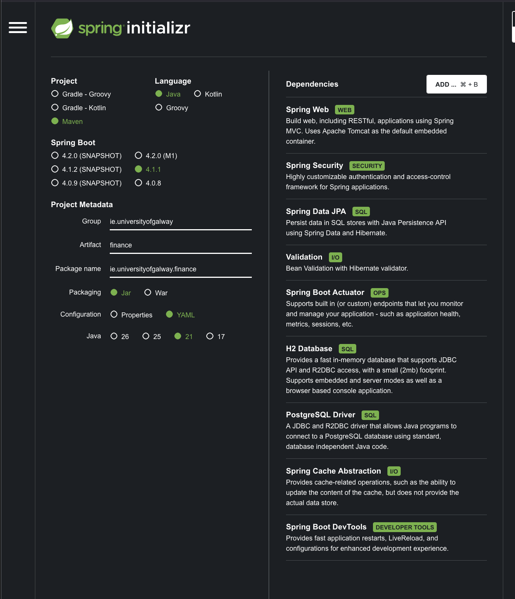
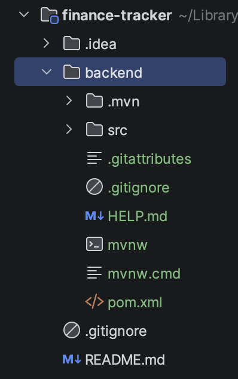
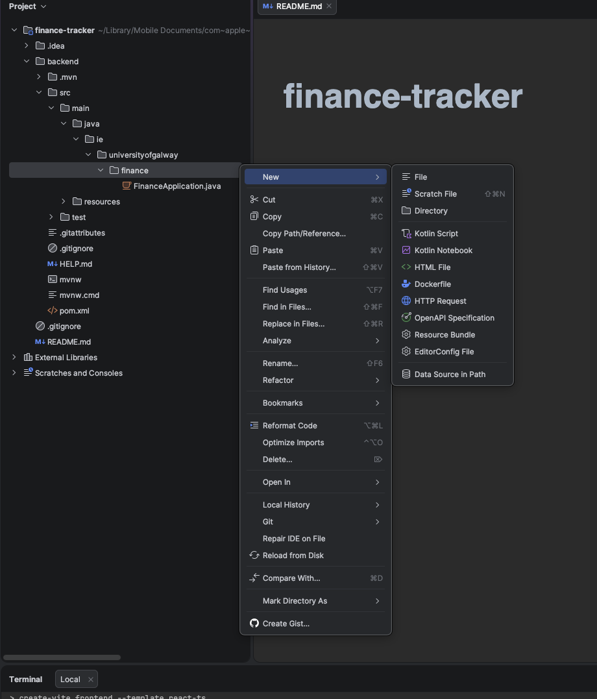
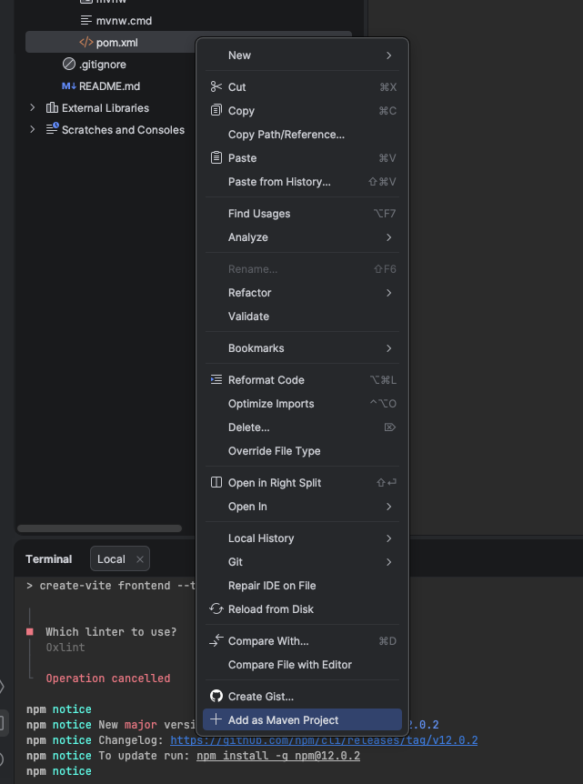
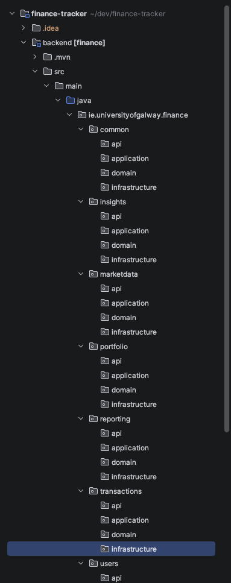
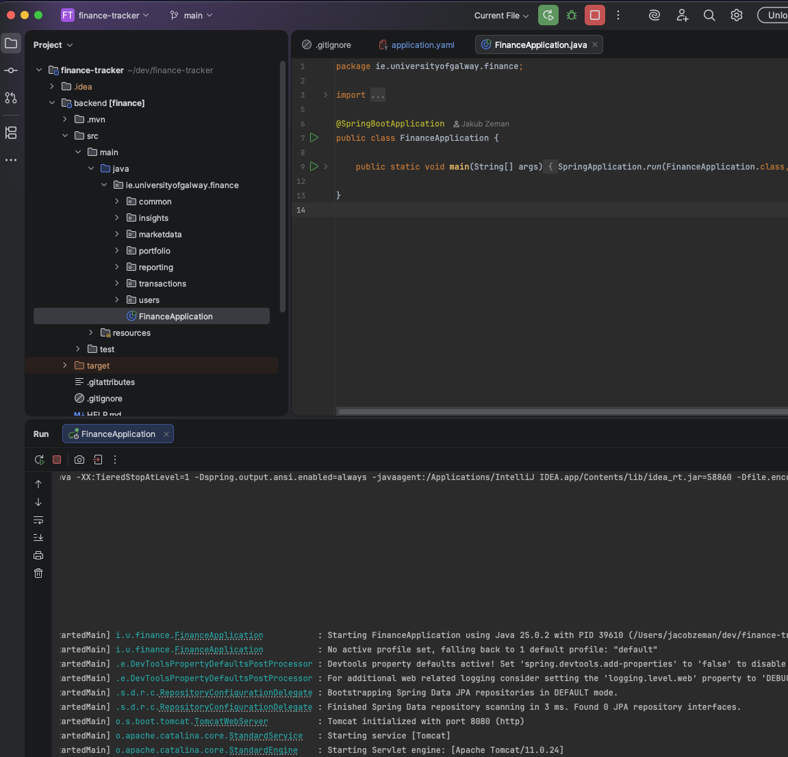
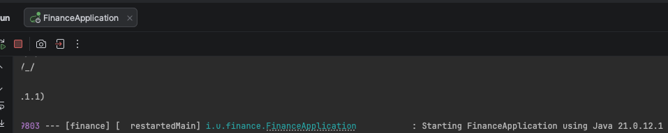
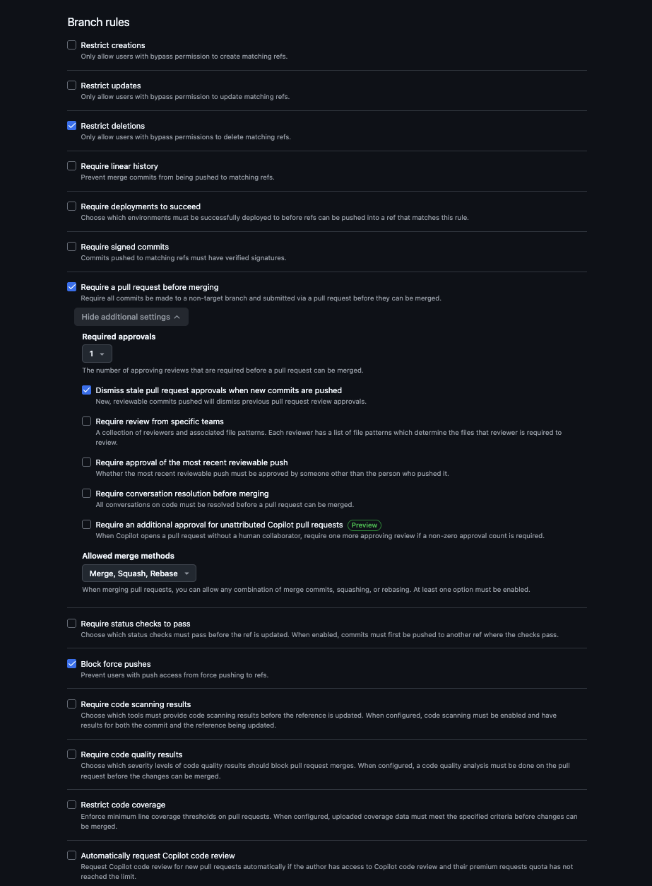

Repo: [https://github.com/cool-coders-club-party/finance-tracker.git](https://github.com/cool-coders-club-party/finance-tracker.git)
Clone into it: `git clone https://github.com/cool-coders-club-party/finance-tracker.git`

Nialls Fix to dependency issue:
Go to: File → Project Structure → Project → SDK dropdown → Download JDK → version 21, vendor Eclipse Temurin → OK.
Click right side Maven logo, reload icon, and reload all Maven.

## Backend environment — what I set up and why




I generated the Spring Boot project once from `start.spring.io`. Nobody else needs to repeat this — you'll just clone the repo and IntelliJ will pull everything down.

**The choices:**

- **Maven** — the build tool. It reads `pom.xml`, downloads every library listed there, compiles, and runs tests. Same command works for all of us and for CI. Gradle is the alternative; Maven is what most Spring tutorials use.
- **Java 21** — current long-term-support version. Gives us records, which make DTOs one line instead of thirty.
- **Spring Boot 4.1.1** — highest stable release, no SNAPSHOT or milestone labels. Those are unfinished builds that can break under you.
- **Package name `ie.universityofgalway.finance`** — the root of our code tree. Spring only looks for controllers and services _inside_ this package, so if you create a class outside it, Spring silently ignores it. That's the #1 "why isn't my endpoint working" cause.
- **Jar packaging** — the app builds into a single runnable file with a web server bundled inside. `java -jar` and it's live.
- **YAML config** — we get `application.yml` instead of `application.properties`. Nested and readable, and one file can hold all our environment profiles. Careful with indentation, it's whitespace-sensitive.

**The dependencies:**

|What|Why|
|---|---|
|Spring Web|REST endpoints + the HTTP client. Everyone uses this.|
|Spring Data JPA|Database entities and repositories — write an interface, Spring writes the SQL.|
|Validation|`@NotNull`, `@Email` etc. on incoming data so bad requests get rejected at the edge.|
|Spring Security|Dev1's auth work. Needs to be in from the start — retrofitting it later touches every endpoint.|
|Actuator|`/actuator/health` for free. Useful for the demo.|
|H2 Database|In-memory DB, zero install. What we all run locally. Wipes on restart.|
|PostgreSQL Driver|The real database, for a separate profile later.|
|Spring Cache Abstraction|`@Cacheable` — I need it so live price lookups don't blow through our free API quota.|
|DevTools|Auto-restarts the app when you save. Quality of life.|

**What each of you does:**

1. IntelliJ → File → New → Project from Version Control → paste the repo URL
2. Say yes when it offers to load the Maven project
3. Set JDK to 21 if prompted (File → Project Structure → SDK — IntelliJ can download one)
4. Run `FinanceApplication` once to confirm it starts
5. `cd frontend && npm install` — `node_modules` isn't in the repo
6. Make your own branch, work only in your own feature package

---
## Once Generated
I got the zip file, unzipped and dragged it to our repo under the folder `backend`

I had the use **Command+Shift+.** to be able to see the .mvn, .gitignore and .gitattributes files and drag them manually.



**`.gitattributes`** —  tells git to keep `mvnw` with Unix line endings even on Windows machines. Without it, a Windows teammate clones, git converts the line endings, and `./mvnw` fails for them with a cryptic error. Cheap insurance if anyone on the team isn't on macOS.

**`.gitignore`** — git reads `.gitignore` files at every level, so `backend/.gitignore` applies to `backend/` and below, and stacks with the one at your root. Spring's version covers Java build output properly: `target/`, IDE files for IntelliJ/Eclipse/NetBeans/VS Code. Your root one from GitHub's Java template overlaps but isn't identical.


> I was prompted to do the frontend setup but I will leave that for Adam 

---
## Frontend setup: For Adam 
### Add the frontend

IntelliJ terminal, from the repo root:

```
npm create vite@latest frontend -- --template react
cd frontend
npm install
```

Then check your root `.gitignore` has `node_modules/`, `dist/`, `.idea/`, `application-local.yml`, `.env` — before you commit, so `node_modules` never enters history.

```
cd ..
git add .
git commit -m "chore: scaffold React frontend"
git push
```

---

I was trying to add the dependencies but I couldn't see the the `{RIGHT_CLICK)finance -> NEW -> Package` button.

This was because IntelliJ hadnt loaded the Maven project, so it didnt show `src/main/java` in the Java source root. It was treating them as plain folders.

FIX:
Right click the pom.xml and click + Add as a Maven Project
This will dowload the dependencies and then java gets a blue source-root icon and `New` will now show Java Class, Package, Record, Interface.


---
After the previous issue was fixed, I manually created these packages at `ie.universityofgalway.finance`

### What the packages are for

**The seven top-level ones = who owns what.** One per feature, one owner each. You only edit files inside your own, which means five people can work in one codebase without constant merge conflicts. `common` is the shared exception — needs a heads-up before you touch it.

**The four inside each = Clean Architecture, from Lecture 1.** Same four every time, so anyone can find their way around anyone's feature:

|Package|Holds|Knows about|
|---|---|---|
|`api`|REST controllers, request/response DTOs|HTTP|
|`application`|services — the use cases, the orchestration|the domain|
|`domain`|your model + interfaces. Plain Java, no annotations|nothing|
|`infrastructure`|HTTP clients, JPA repositories, cache impl|databases, external APIs|

Dependencies point **inward only**: `api → application → domain`, and `infrastructure` implements interfaces declared in `domain`. `domain` depends on nothing.

---

In `backend/src/main/resources/application.yml` 
I added:
```yaml
spring:  
  application:  
    name: finance   
  h2:  
    console:  
      enabled: true  
  jpa:  
    hibernate:  
      ddl-auto: update
```

Then I opened and ran `FinanceApplication.java`
We can see:
- `Tomcat initialized with port 8080`
- `HikariPool-1 - Start completed` — H2 database connected
- `Initialized JPA EntityManagerFactory` — Hibernate up


This is the first time we know the whole toolchain works end to end!!!!

---
## Everyone needs to do this
### JDK 21, Eclipse Temurin, set in Project Structure
Go to: File → Project Structure → Project → SDK dropdown → Download JDK → version 21, vendor Eclipse Temurin → OK. 

Now when running FinanceApplication, it runs the correct version that matches the `pom.xml`

### Why 21?
**It's the current LTS** — Long Term Support. Oracle designates one release every two years as LTS and supports it for years; the ones in between (22, 23, 24, 25) are six-month feature releases that go end-of-life almost immediately.

### Why Temurin
Temurin is the pragmatic default:
- **Unambiguously free**, for any use, with no licence terms to read. Oracle's own JDK has had commercial-use restrictions that changed twice in recent years, which is a needless thing for a student team to think about.
- **Vendor-neutral**, run by the Eclipse Foundation, and the common recommendation in Spring's own docs and tooling.
- **Available directly in IntelliJ's Download JDK dropdown**, so it's one click.
---

## Created a branch ruleset to protect the `main` branch
1 person always needs to approve someones merge to main 



I had to change the repo to public and join an organization cool-coders-club-party to be able to use the ruleset without paying a fee. 

---

